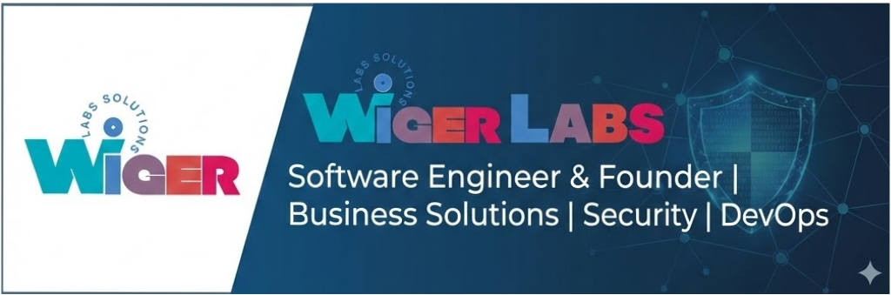

  

  <h1>Hi there, I'm a Software Engineer & Founder 👋</h1>
  

    <b>Startup Owner (WigerLabs) | React & NestJS Developer | Security Enthusiast</b>
  

  
  
  
  

 

## 👨‍💻 About Me

I am a **Software Engineer** and the Founder of **WigerLabs**, a software startup based in **Sri Lanka** dedicated to building business solutions.

Currently, I am an undergraduate Software Engineering student, balancing enterprise development with advanced studies in **Cyber Security** and **DevOps**. My focus is on building scalable, secure systems that bridge the gap between complex backend architecture and user-friendly interfaces.

* 🔭 **Current Project:** Building a centralized project management admin panel for WigerLabs and POS systems for local finance sectors.
* 🌱 **Learning:** Advanced **NestJS** architecture, **SOC Operations**, and **Penetration Testing**.
* 🔧 **Specialties:** Automation (n8n, Puppeteer), CLI Productivity (WSL, Neovim), and Java Ecosystems.
* 🚀 **Goal:** To integrate robust security protocols into modern DevOps pipelines.

---

## 🛠 Tech Stack & Tools

### Languages

### Frontend & Mobile

### Backend & Frameworks

### DevOps, Security & Automation

---

## 📊 GitHub Statistics

  
  
    

  

    

  

 

  
© 2025 WigerLabs | Designed for Excellence

